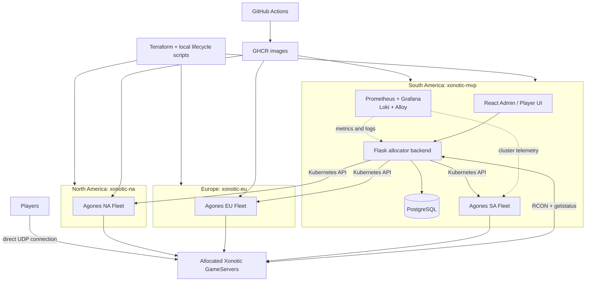
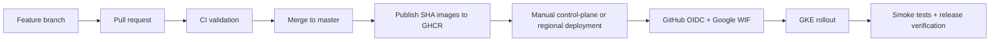

# Xonotic Kubernetes Game Server Platform

[](https://github.com/NFNV/kubernetes_xonotic_gameserver/actions/workflows/ci.yml)
[](docs/ci-cd.md#control-plane-deployment)
[](https://kubernetes.io/)
[](https://agones.dev/)
[](https://developer.hashicorp.com/terraform)
[](https://github.com/NFNV/kubernetes_xonotic_gameserver/pkgs/container/xonotic-server)

A Kubernetes-native platform for deploying and operating dedicated Xonotic game servers with Agones on GKE. A centralized control plane allocates regional match servers, configures map and mode through RCON, verifies live state with `getstatus`, tracks tournament operations, and exposes metrics and logs.

The tournament workflow is the operational use case, not the product boundary. The project demonstrates the infrastructure and lifecycle automation behind running multiplayer game servers across regions.

## Architecture



- **Infrastructure plane:** Terraform provisions zonal GKE clusters and UDP firewall rules. Agones Fleet/FleetAutoscaler manage warm GameServer capacity.
- **Control plane:** React, Flask, and PostgreSQL run only in South America. The backend uses scoped regional kubeconfig contexts to operate all three game-server planes.
- **Observability plane:** Prometheus, Grafana, Loki, Alloy, kube-state-metrics, and node-exporter observe the primary cluster. Regional telemetry federation is not implemented yet.

## Key Capabilities

- Agones-backed Xonotic Fleets with dynamic UDP endpoints
- Region-aware allocation across South America, Europe, and North America
- Server-pool capacity status for Ready and Allocated GameServers
- Password-protected Admin View and public read-only Player View
- PostgreSQL-backed tournaments, teams, rounds, matches, and assignment history
- Single-elimination bracket generation for 2, 4, and 8 teams
- Verified map/mode configuration through allowlisted RCON and `getstatus`
- Result recording, winner advancement, and automatic GameServer release
- Prometheus alert evaluation, Grafana dashboards, and Loki log exploration
- Offline-safe CI, immutable GHCR releases, and manual approval-gated CD

## GameServer Allocation Lifecycle

1. FleetAutoscaler keeps a small buffer of Xonotic GameServers `Ready`.
2. An operator selects a match and regional server pool.
3. The backend submits an Agones `GameServerAllocation` to that cluster.
4. Agones returns the allocated public address and dynamic UDP port.
5. The backend stores the assignment and regional metadata in PostgreSQL.
6. Allowlisted RCON commands apply map and mode; `getstatus` verifies the live result.
7. The UI exposes the verified endpoint and `connect IP:PORT` command.
8. Recording the result releases the server automatically; manual release and tournament finalization clean up leftovers.

## Multi-Region Design

| Pool | Cluster | Zone | Role |
| --- | --- | --- | --- |
| `south-america-default` | `xonotic-mvp` | `southamerica-west1-a` | Control plane and GameServer plane |
| `europe-default` | `xonotic-eu` | `europe-west1-b` | GameServer plane only |
| `north-america-default` | `xonotic-na` | `us-central1-a` | GameServer plane only |

Each region has isolated Terraform state, Agones, a Fleet/FleetAutoscaler, regional RCON configuration, and UDP ports `7000-7010`. The clusters are intentionally temporary and can be brought online independently. See [Regional server pools](docs/region-server-pools.md).

## CI/CD And Release Flow



- CI validates code, Terraform, scripts, manifests, dashboards, and container builds even when every cluster is offline.
- Merges to `master` publish coordinated `sha-<full-git-sha>` images. The root [`VERSION`](VERSION) file supplies semantic release identity without replacing immutable deployment tags.
- CD is manually triggered and deploys application releases only. It does not create or destroy infrastructure.
- `up.sh`, `down.sh`, and the regional scripts remain the infrastructure lifecycle and cost-control interface.

Full workflow, OIDC/WIF, IAM, rollback, and repository setup details are in [CI/CD](docs/ci-cd.md).

## Observability

Prometheus scrapes allocator, Kubernetes, node, container, and primary Agones Fleet metrics. Loki stores short-lived primary-cluster pod logs collected by Alloy, while Grafana provisions cluster, allocator, and log dashboards.

Current alerts cover backend availability, allocation failures, RCON failures, map/mode verification failures, repeated pod restarts, high node memory, and zero Ready GameServers. Alerts are evaluated in Prometheus only; external Alertmanager routing is intentionally deferred.

See the [observability guide](platform/observability/README.md) for queries, dashboards, resource impact, and alert test/recovery procedures.

## Quick Start And Lifecycle

Prerequisites include `gcloud`, Terraform, `kubectl`, Helm, Docker, and access to the configured GCP project. Local credentials belong in the ignored `scripts/env.sh` file.

```bash
cp scripts/env.sh.example scripts/env.sh
scripts/generate-admin-auth.sh --username admin --password '<dev-password>'
```

Add the generated auth exports and required GCP/RCON values to `scripts/env.sh`, then bring up only the environments needed:

```bash
./scripts/up.sh                       # South America control plane + GameServer plane
./scripts/up-region.sh europe         # Europe GameServer plane only
./scripts/up-region.sh north-america  # North America GameServer plane only
```

The primary `up.sh` selects the newest successfully published `master` release and brings up the SA Fleet, backend, and frontend with one coordinated immutable SHA. Set `XONOTIC_RELEASE_SHA` to pin a previously published release; routine deployments to already-running clusters remain manual GitHub Actions workflows.

Access remains local through port-forwarding:

```bash
kubectl --context gke_xonotic-gameserver_southamerica-west1-a_xonotic-mvp \
  port-forward -n xonotic-allocator-backend \
  service/xonotic-allocator-frontend 18080:8080
```

Open `http://127.0.0.1:18080`. Teardown is explicit and region-scoped:

```bash
./scripts/down-region.sh north-america
./scripts/down-region.sh europe
./scripts/down.sh
```

Run regional lifecycle commands sequentially because they share the local Terraform working directory. Detailed verification, port-forwarding, troubleshooting, and teardown behavior are in [Operations](docs/operations.md).

## Screenshots

Screenshots are intentionally not fabricated or linked before they exist. The expected portfolio captures and filenames are tracked in [docs/screenshots/README.md](docs/screenshots/README.md).

## Known Limitations

- GKE clusters are single-node and sized for a dev/portfolio environment, not commercial-scale workloads.
- The control plane and central observability stack run only in South America.
- PostgreSQL is an in-cluster, single-instance deployment without production HA or managed backups.
- Prometheus and Loki use short, dev-oriented retention; Loki storage is ephemeral.
- Alerts have no external Alertmanager notification routing.
- Routine application deployments are manually triggered; primary bring-up bootstraps the latest published release, while regional infrastructure lifecycle remains local-script driven.
- Regional access uses scoped service-account kubeconfig credentials rather than production-grade cross-cluster identity.
- Admin authentication is basic password/session protection with no OAuth, roles, public Ingress, or external identity provider.

## Documentation

| Guide | Scope |
| --- | --- |
| [Operations](docs/operations.md) | Day-to-day checks, access, troubleshooting, and teardown |
| [CI/CD](docs/ci-cd.md) | GitHub Actions, releases, OIDC/WIF, IAM, and rollback |
| [Regional server pools](docs/region-server-pools.md) | Pool mapping, multicluster access, capacity states, and regional lifecycle |
| [RCON/admin controls](docs/rcon-admin-controls.md) | RCON protocol, allowlisted controls, and smoke tests |
| [Observability](platform/observability/README.md) | Metrics, logs, dashboards, alerts, and resource footprint |
| [Infrastructure](infra/README.md) | Terraform resources, regional workspaces, and networking |
| [Persistence design](docs/postgres-persistence-design.md) | PostgreSQL domain model and ownership boundaries |
| [Tournament design](docs/tournament-admin-design.md) | Tournament workflow and bracket model |
| [Map/mode verification](docs/tournament-map-mode-verification.md) | Verified compatibility matrix and probe flow |
